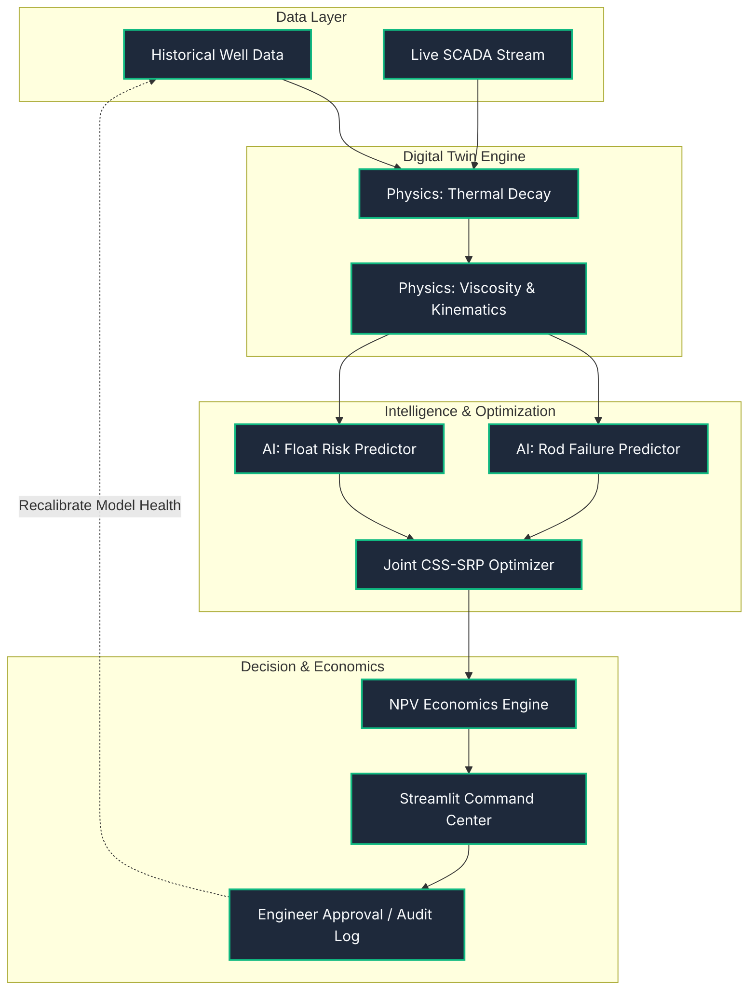

# Adaptive Baghewala Twin (BAT) - SIH26120 Architecture

This document provides the complete, technically accurate architecture of the Adaptive Baghewala Twin. It maps perfectly to our working Python 3.11 Streamlit prototype while clearly delineating what is simulated and what is planned for future production.

---

## 1. Executive Architecture (One-Slide Version)
*Use this 6-block diagram for the main pitch deck when you only have 10 seconds to explain the flow.*

```mermaid
flowchart LR
    A[Data & Telemetry\n(Simulated)] --> B[Digital Twin State\n(Physics)]
    B --> C[AI Inference & Risk\n(Machine Learning)]
    C --> D[Joint Optimizer\n(CSS + SRP)]
    D --> E[Human-in-the-Loop\n(Review & Audit)]
    E --> F[Feedback & Drift\n(Recalibration)]
    
    classDef default fill:#1E293B,stroke:#38BDF8,stroke-width:2px,color:#F8FAFC,font-family:Inter;
```

---

## 2. SIH PPT Architecture (Simplified 10-Block Flow)
*Use this for the technical architecture slide in your PPT.*



---

## 3. Detailed Engineering Architecture (Full Workflow)
*For technical documentation and deep-dive technical judge questions.*

```mermaid
flowchart TD
    subgraph DATA_LAYER ["Data Layer"]
        H_DATA[Historical Data\n(Production, CSS, Rod Failures)]:::data
        S_DATA[Current / Streaming Data\n(Viscosity, Temp, SPM, Stroke)]:::data
    end

    subgraph TWIN_LAYER ["Digital Twin Layer"]
        FE[Feature Engineering]:::process
        T_MOD[Thermal State Model\n(Decay & Heat Loss)]:::physics
        V_MOD[Fluid Properties\n(Viscosity Mapping)]:::physics
        W_MOD[SRP Mechanics\n(Wave Equation Fallback)]:::physics
    end

    subgraph HYBRID_AI_LAYER ["Physics + ML Architecture"]
        RF_RISK[ML: Float Risk Regressor]:::ai
        RF_FAIL[ML: Catastrophic Failure Classifier]:::ai
        FALLBACK[Physics Simulation Fallback]:::fallback
    end

    subgraph OPTIMIZATION_LAYER ["Joint CSS + SRP Optimization"]
        OPT_ENG[Optimization Engine]:::opt
        SAFE_ENV[Safe Operating Envelope]:::opt
        ECO_OPT[Economic Optimizer\n(Revenue - Steam - Penalty)]:::opt
    end

    subgraph DECISION_LAYER ["User / Engineer Layer"]
        WHAT_IF[What-If Scenario Simulator]:::ui
        REC[AI Recommendation]:::ui
        ENG_ACT{Human Engineer}:::user
        AUDIT[Audit Log & SMS Alert]:::user
    end

    subgraph FEEDBACK_LAYER ["Closed-Loop Feedback"]
        OBS[Observed Well Response]:::feed
        DRIFT[Model Health / Drift Detection]:::feed
    end

    %% Flow connections
    H_DATA --> FE
    S_DATA --> FE
    FE --> T_MOD
    T_MOD --> V_MOD
    V_MOD --> W_MOD
    
    V_MOD & W_MOD --> RF_RISK & RF_FAIL
    RF_FAIL -.->|If ML Fails| FALLBACK
    
    RF_RISK & RF_FAIL --> OPT_ENG
    OPT_ENG --> SAFE_ENV
    SAFE_ENV --> ECO_OPT
    
    ECO_OPT --> WHAT_IF
    ECO_OPT --> REC
    WHAT_IF --> REC
    
    REC --> ENG_ACT
    ENG_ACT -- Approve / Reject --> AUDIT
    
    AUDIT --> OBS
    OBS --> DRIFT
    DRIFT -.->|Recalibration Trigger| T_MOD

    classDef data fill:#0f172a,stroke:#64748b,stroke-width:2px,color:#fff;
    classDef process fill:#1e293b,stroke:#38bdf8,stroke-width:2px,color:#fff;
    classDef physics fill:#1e40af,stroke:#60a5fa,stroke-width:2px,color:#fff;
    classDef ai fill:#8b5cf6,stroke:#c4b5fd,stroke-width:2px,color:#fff;
    classDef fallback fill:#b45309,stroke:#fbbf24,stroke-width:2px,color:#fff;
    classDef opt fill:#065f46,stroke:#34d399,stroke-width:2px,color:#fff;
    classDef ui fill:#374151,stroke:#9ca3af,stroke-width:2px,color:#fff;
    classDef user fill:#9f1239,stroke:#f43f5e,stroke-width:2px,color:#fff;
    classDef feed fill:#3f6212,stroke:#a3e635,stroke-width:2px,color:#fff;
```

---

## 4. Component-to-Code Mapping
*Strict mapping of architecture to the actual Python 3.11 codebase.*

| Architecture Component | Status | Code Mapping |
| :--- | :--- | :--- |
| **Data Layer (Synthetic)** | `[IMPLEMENTED]` | `data/data_generator.py` |
| **Data Layer (Real-time SCADA)** | `[FUTURE PRODUCTION]` | *Not Implemented (Simulated via App State)* |
| **Feature Engineering** | `[IMPLEMENTED]` | `app.py` *(Dataframe construction block)* |
| **Physics: Thermal Engine** | `[IMPLEMENTED]` | `core/thermal_model_v2.py` |
| **Physics: Wave Equation** | `[IMPLEMENTED]` | `core/wave_equation.py` |
| **ML: Float Risk & Failure** | `[IMPLEMENTED]` | `core/models/*.pkl` (Trained via `core/ml_trainer.py`) |
| **Model Health & Fallback** | `[IMPLEMENTED]` | `core/model_loader.py` |
| **CSS-SRP Joint Optimizer** | `[IMPLEMENTED]` | `core/optimizer.py` + `app.py` |
| **Economic Optimization** | `[IMPLEMENTED]` | `app.py` *(Economic Optimizer Tab)* |
| **What-if Simulator** | `[IMPLEMENTED]` | `app.py` *(Sidebar Slider Overrides)* |
| **Human-in-the-Loop Audit** | `[IMPLEMENTED]` | `app.py` *(Field Command Tab)* |
| **Online Continual Learning**| `[PLANNED]` | *Requires live edge-hardware connection* |

---

## 5. System Explanations

### ML + Physics Interaction (Hybrid State)
The architecture does not use ML to blindly predict oil. The Physics engine (`thermal_model_v2.py`) strictly bounds the thermal decay and viscosity states. The Machine Learning model (Random Forest) sits *on top* of the physics output to recognize complex, non-linear failure patterns (rod floating) that physics equations struggle to calculate in real-time.

### CSS-SRP Coupling
CSS (steam injection) and SRP (pumping) are highly coupled. Changing the CSS steam volume directly alters the reservoir heat profile, which lowers fluid viscosity. The Joint Optimizer understands that a hotter well allows for a higher SPM without snapping the rod. The architecture unifies these previously siloed decisions.

### Optimization & Safe Operating Envelope
The optimizer does not just maximize production. It searches for an SPM that produces the most oil *only* if the Catastrophic Failure Risk remains below the safety threshold (e.g., 60%). The What-If simulator demonstrates this envelope by letting the user break the limit and observing the simulated rod snap.

### Model Health & Fallback Flow
If `scikit-learn` fails (e.g., due to Windows Defender WDAC blocks), the `model_loader.py` traps the exception. The system seamlessly downgrades to "Physics Simulation Fallback", relying solely on `wave_equation.py`. The dashboard clearly signals `DEGRADED` health, ensuring operators are never blind.

---

## 6. The 5-Minute Pitch Demo Flow

1. **The Hook (Well Analytics):** Open the dashboard. Turn the AI optimizer OFF. Show how as days advance, temperature plummets, viscosity spikes, and the manual pump speed causes the Float Risk and Failure Risk to violently spike into the red zone.
2. **The Physics (What-If Simulation):** Move the Steam-Volume slider. Show the judges how changing the CSS input dynamically updates the entire chain, proving the physics simulator is real.
3. **The AI Save (Joint Optimization):** Click "Enable AI Coupled Optimizer". The manual straight line snaps into a curved, dynamic setpoint schedule. Watch the red failure risk immediately drop to zero.
4. **The Drift (Pump-as-Thermometer):** Click "Inject Geological Disturbance". The measured temp breaks away from the prediction. The AI triggers a "DRIFT DETECTED" alarm, proving the system is self-aware and can correct a wrong model.
5. **The Value (Economics & Audit):** Switch to the Economic Tab to show the massive difference in "₹ per barrel" when avoiding a ₹4,000,000 rod replacement penalty. Finally, show the Field Command tab, click "Approve", and show the Audit Log capturing the human-in-the-loop decision.

---

## 7. SIH PPT Footer Text
*Place this 3-sentence summary at the bottom of your Architecture slide in the PowerPoint:*

> "An integrated hybrid twin connecting thermal CSS physics with surface SRP mechanics. An AI layer predicts catastrophic rod failure and float risk, driving a constrained joint-optimizer to recommend safe pump setpoints. All AI decisions are passed through an economic layer and require human-in-the-loop approval, ensuring strict operational safety and explainability."
